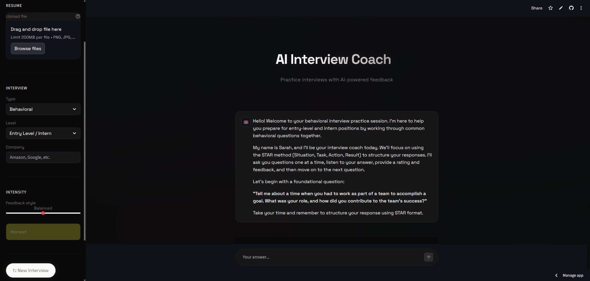

# AI Interview Coach 🎯

An AI-powered interview preparation app that helps you practice behavioral and technical interviews with real-time feedback.

**[Live Demo](https://ai-interview-coach-nwrtvkf6rnjzgq3whijkbu.streamlit.app/)**



## Features

- **Multiple Interview Types** - Practice behavioral, technical (SWE), product/PM, or general interviews
- **Resume Upload** - Upload your resume (PDF or image) for personalized questions about your actual experience
- **Company-Specific Mode** - Get questions tailored to specific companies like Amazon, Google, Meta, etc.
- **Adjustable Feedback Intensity** - Choose between Chill (encouraging), Balanced (honest), or Brutal (no mercy) feedback modes
- **STAR Method Evaluation** - Get structured feedback based on Situation, Task, Action, Result framework
- **Real-time Scoring** - Receive a score out of 10 with specific suggestions for improvement

## Tech Stack

- **Frontend:** Streamlit
- **AI:** Anthropic Claude API
- **Language:** Python
- **Deployment:** Streamlit Cloud

## How It Works

1. Select your interview type and difficulty level
2. Optionally upload your resume for personalized questions
3. Choose a target company (optional)
4. Set your preferred feedback intensity
5. Answer questions and receive instant AI-powered feedback
6. Improve your responses based on detailed suggestions

## Local Development

1. Clone the repo
```bash
git clone https://github.com/FreezeXero/ai-interview-coach.git
cd ai-interview-coach
```

2. Install dependencies
```bash
pip install -r requirements.txt
```

3. Create a `.streamlit/secrets.toml` file
```toml
ANTHROPIC_API_KEY = "your-api-key-here"
```

4. Run the app
```bash
streamlit run app.py
```

## Author

**Rafay Farah**
- LinkedIn: [rafayfarah](https://linkedin.com/in/rafayfarah)
- GitHub: [FreezeXero](https://github.com/FreezeXero)

